# Walking Pet

나만의 캐릭터와 함께 걷는, 워킹펫

 

## 0. 목차

[1. 진행 기간](#1-진행-기간)  
[2. 프로젝트 개요](#2-프로젝트-개요)  
[3. 서비스 기능 소개](#3-서비스-기능-소개)  
[4. 프로젝트 산출물](#4-프로젝트-산출물)  
[5. 기술 스택](#5-기술-스택)  
[6. 팀원 소개](#6-팀원-소개)  

 

## 1. 진행 기간

<b>2024. 04. 09. 화요일 ~ 2024. 05. 19. 일요일 (6주)</b>

 

## 2. 프로젝트 개요

"나만의 캐릭터와 함께 즐겁게 걷기"를 주제로 시작한 안드로이드 어플리케이션입니다. 캐릭터, 목표, 배틀, 뽑기, 그룹, 랭킹, 기록의 다양한 컨텐츠를 즐길 수 있습니다.

## 3. 서비스 기능 소개

### [1] 모바일

**🌟 메인화면**: 걸음수 확인하기
  
**🌟 캐릭터**: 캐릭터의 능력치 확인, 캐릭터 변경하기, 경험치 아이템, 레벨업
  
**🌟 목표**: 일일 목표, 주간 목표
  
**🌟 배틀**: 배틀 대기, 시작, 결과
  
**🌟 뽑기**: 일반 상자, 고급 상자, 중복 뽑기
  
**🌟 그룹**: 그룹 가입, 생성, 탐색, 검색
  
**🌟 랭킹**: 개인 랭킹(어제/실시간/누적), 배틀 랭킹, 그룹 랭킹
  
**🌟 기록**: 기록 생성, 다른 유저 및 이벤트 기록 확인
  

### 🌟 메인화면

메인 화면에서는 내가 선택한 펫의 모습과 함께 걸음수가 표시 된다.  
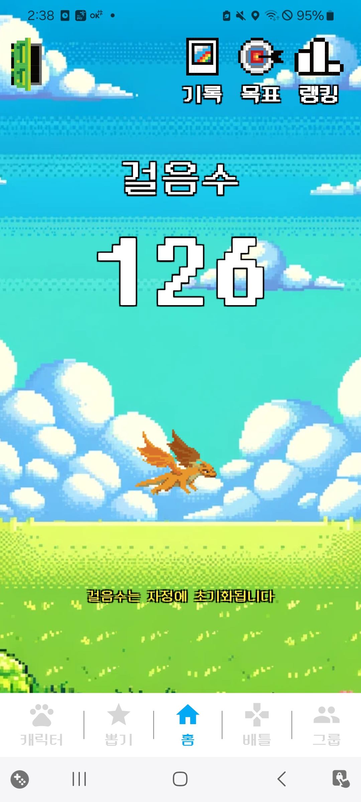
  

### 🌟 캐릭터 상세보기

유저는 캐릭터와 관련된 다양한 기능을 확인할 수 있다.

- #### 캐릭터의 능력치 
  내가 선택한 캐릭터의 상세 능력치를 확인할 수 있다. 능력치에는 체력, 공격력, 방어력이 있다.  
  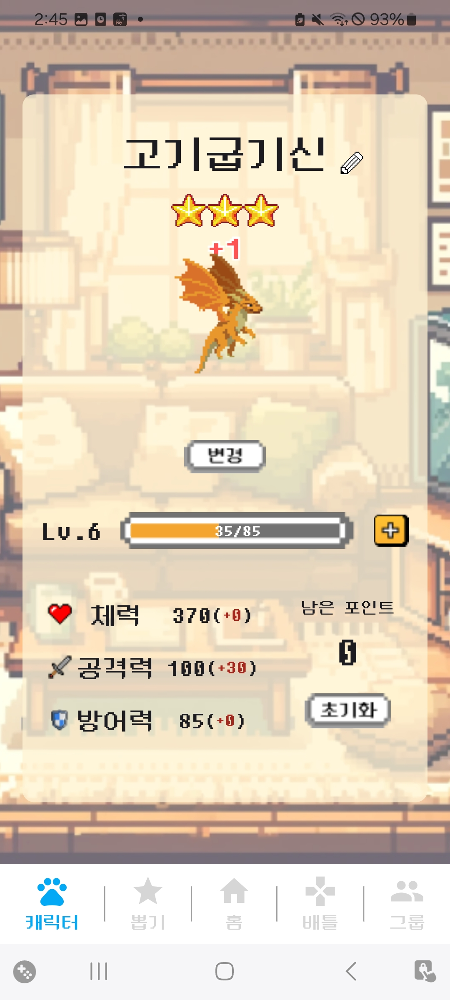
- #### 캐릭터 변경하기 
  뽑기를 통해 캐릭터를 수집할 수 있으며, 수집한 캐릭터 중 하나로 변경이 가능하다.   
  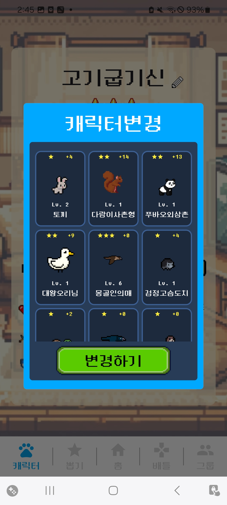
- #### 스탯 포인트 분배 

  레벨업을 통해 얻은 스탯 포인트로 체력, 공격력, 방어력을 올릴 수 있다.   

- #### 경험치 아이템 사용 
  다양한 경로를 통해 얻은 경험치 아이템으로 캐릭터의 레벨을 올릴 수 있다.  
  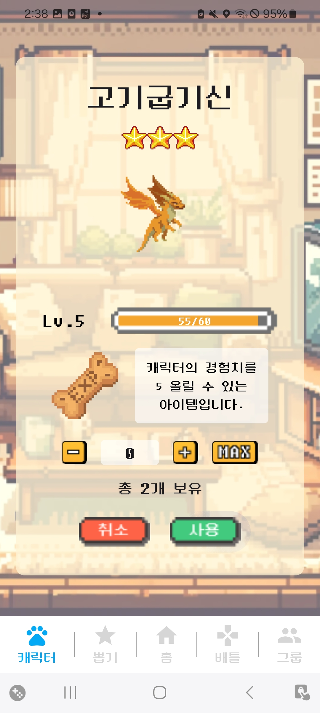
- #### 레벨업 
  다음 레벨로 올라가기 위한 경험치를 채우면 캐릭터가 레벨업 한다.   
  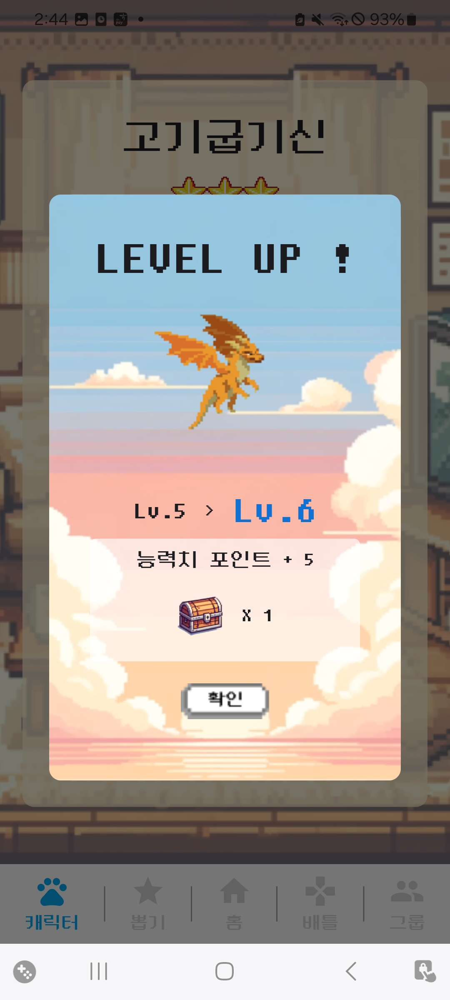
  
### 🌟 목표
유저는 걸음수 관련 목표를 확인할 수있다.

  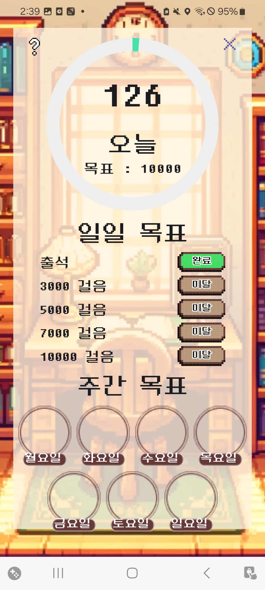
- #### 개인 목표 
  사용자는 현재 걸은 걸음 수를 통해 일일 목표를 달성할 수 있다.  목표에는 0/3000/5000/7000/10000보 달성이 있다. 각 목표에 따라 획득할 수 있는 보상이 다르다  

- #### 주간 목표  
  일일 목표 5천보를 달성하면 해당 요일에 마커가 찍힌다. 매주 월요일 자정에 초기화 되며 일일목표 달성 횟수에 따라 보상이 차등 지급된다. 

### ⚔ 배틀
유저는 다양한 컨텐츠를 통해 성장시킨 캐릭터로 다른 유저와 배틀할 수 있다.

- #### 배틀 대기 
  선택한 캐릭터를 통해 배틀을 진핼할 수 있다. 일일 배틀 제한 횟수는 10회 이다.   
  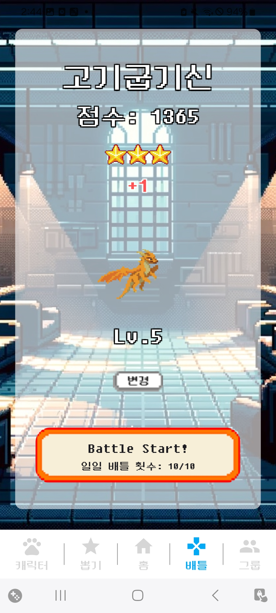
- #### 배틀 시작 
  나의 배틀 점수를 바탕으로 상대가 매칭된다. 기본적으로 선공으로 시작하며 한턴씩 공격을 주고 받는다.  
  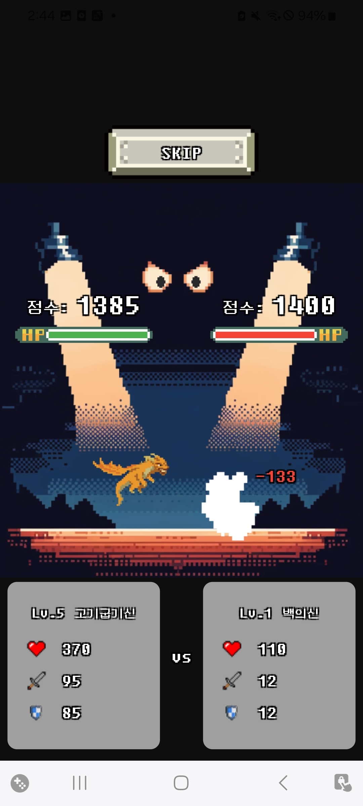
- #### 배틀 결과 
  배틀 결과로 배틀 점수와 아이템을 보상으로 얻는다.  
  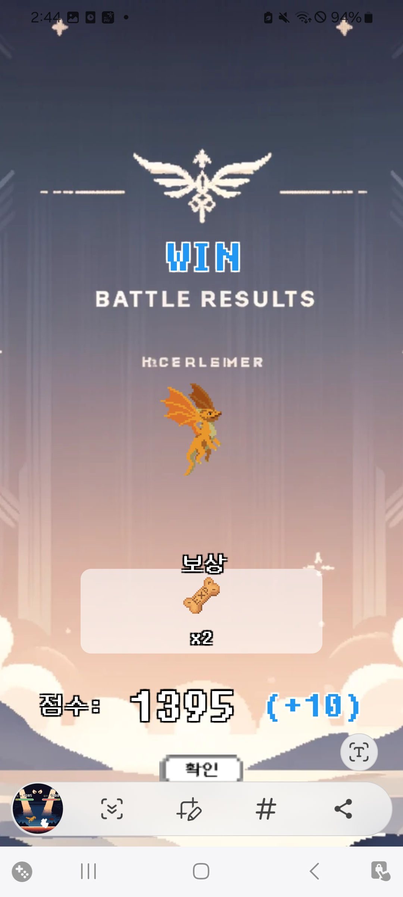

### 🌟 뽑기
사용자는 다양한 컨텐츠로 상자를 얻을 수 있고, 상자를 사용하여 캐릭터를 획득할 수 있다. 
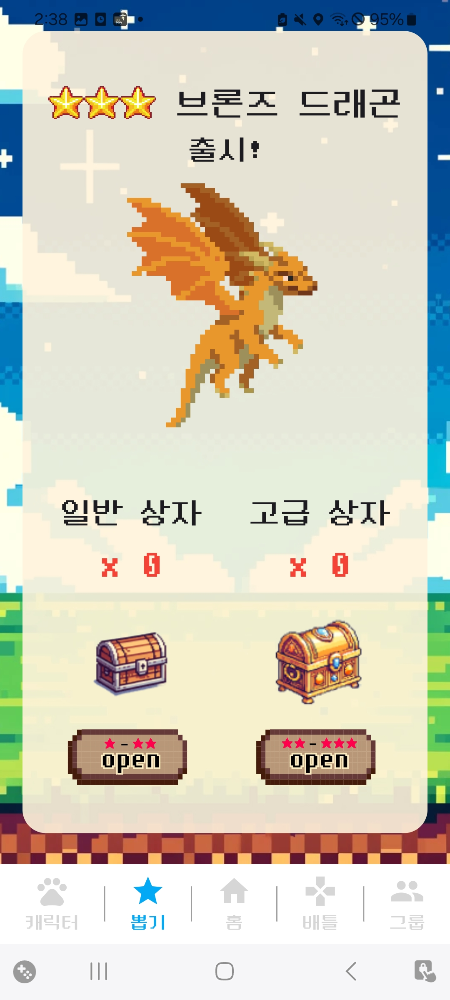

- #### 일반 상자
  1성과 2성의 캐릭터가 나온다.   
- #### 고급 상자
  2성과 3성의 캐릭턱 나온다.   
  
  2성과 3성의 캐릭턱 나온다.   
  
- #### 중복 뽑기
  이미 가지고 있는 캐릭터를 중복으로 뽑았을 시 캐릭터가 업그레이드 되며, 기본 능력치가 올라간다.   

### 🌟 그룹
유저는 그룹에 가입해서 다른 유저와 함께 워킹펫을 즐길 수 있다. 

- #### 그룹 가입
  유저는 최대 3개의 그룹에 가입이 가능하다. 그룹 인원은 최대 6명이다   
- #### 그룹 생성
  유저는 그룹을 생성할 수 있으며 공개방/비밀방을 선택할 수 있다.  
- #### 그룹 탐색
  유저는 다른 유저가 만든 그룹을 탐색할 수 있다.  
- #### 그룹 목표
  각 그룹의 목표는 그룹 멤버들의 걸음수로 달성할 수 있으며, 달성했을 시 그룹원들은 보상을 받을 수 있다.

### 🌟 랭킹
유저는 다양한 컨텐츠의 랭킹을 확인할 수 있다.

- #### 개인랭킹
  유저는 어제 / 실시간 / 누적 걸음수의 랭킹을 확인할 수 있다.

  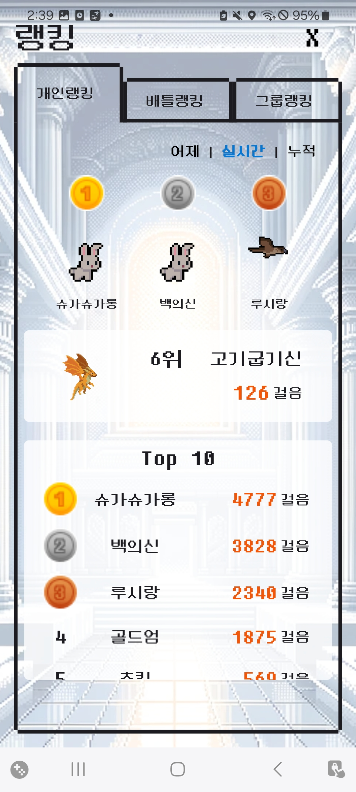
    

- #### 배틀랭킹
  유저는 배틀을 통해 획득한 점수의 랭킹을 확인할 수 있다.

  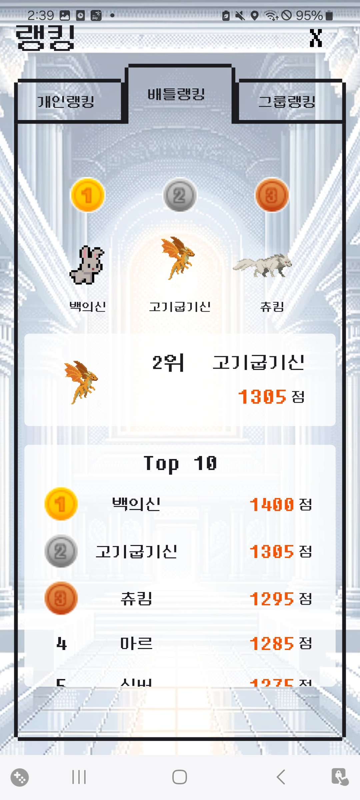
    

- #### 그룹 랭킹
  유저는 그룹 점수의 랭킹을 학인할 수 있다.

### 🌟 기록
유저는 펫과 함께 걸은 기록을 남길 수 있다.

- #### 기록 남기기
  유저는 좋아하는 산책로를 사진을 찍어 앨범의 형식으로 저장할 수 있다. 앨범에는 사진, 선택한 캐릭터, 위치, 등록날짜의 정보가 들어있다.  
- #### 기록 확인하기
  다른 유저가 남긴 기록을 지도를 통해 확인할 수 있고, 유저의 위치와 50m 이내의 기록이라면 선택해서 확인할 수 있다.

  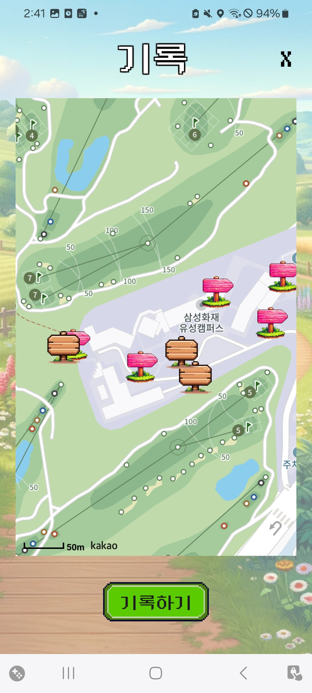
    
- #### 이벤트 기록
  운영자가 설정한 이벤트 기록. 지도에서 확인할 수 있으며, 클릭시 보상을 획득할 수 있다.

 

## 4. 프로젝트 관리

### 일정 관리
- **주요 관리 도구**: JIRA
- **사용 전략** 
  **(1) 매일 아침 각자의 스케줄 확인**
    - 백로그에서 날짜 & 이름 선택 후, 공통 이슈 및 storyPoint 확인
        
        (예시) [04.15] 검색 & [지은] 선택
    - 백로그에서 날짜 & 이름 선택 후, 공통 이슈 및 storyPoint 확인
        
        (예시) [04.15] 검색 & [지은] 선택

  **(2) 1일 당 'storyPoint == 8' 맞추기** (8시간으로 생각하면 ok)
    - 스토리 머리말 **<< xx월.xx일 >>** 로 통일 (ex. 01.15) ⇒ **검색이 용이** 하도록!
    - 스토리 머리말 **<< xx월.xx일 >>** 로 통일 (ex. 01.15) ⇒ **검색이 용이** 하도록!

  **(3) 타임라인의 Epic에 맞는 내용으로 상세 내용 작성하기**
    - 가장 간단한 기능으로 내용 입력하기 ⇒ 최대한 story끼리 내용 겹치지 않게!
    - 2point, 1point 혼재되어 있는 경우 ⇒ 예상치 못한 상황에 대비해, 값이 큰 point 먼저 활용
    - 가장 간단한 기능으로 내용 입력하기 ⇒ 최대한 story끼리 내용 겹치지 않게!
    - 2point, 1point 혼재되어 있는 경우 ⇒ 예상치 못한 상황에 대비해, 값이 큰 point 먼저 활용

  **(4) 내용 및 storyPoint 변경**
    - Epic 및 story point 변경 시에는 팀장과 상의 필수!
    - 필요한 경우, 팀장에게 공유 후 내용 수정
    - Epic 및 story point 변경 시에는 팀장과 상의 필수!
    - 필요한 경우, 팀장에게 공유 후 내용 수정

  **(5) 매일 각자의 스케줄 관리하며 진행**
    시작 시 진행중 / **완료** 버튼 다음에는 **진행중** 누르기
    시작 시 진행중 / **완료** 버튼 다음에는 **진행중** 누르기

- **결과물**

  

### 형상 관리

- **(1) 주요 관리 도구**: GitLab 
- **(1) 주요 관리 도구**: GitLab 

- **(2) 사용 전략**: 적극적인 Rebase 활용

- **(3) 사용 이유** 
  Rebase는 브랜치의 변경 사항을 정리하고 깔끔한 커밋 기록을 관리하는데 큰 도움이 된다. 또한 협업시 변경 사항의 흐름을 명확하게 파악할 수 있게 도와주기에 Rebase 활용을 적극적으로 함.

- **(4) 커밋 메세지 컨벤션**

  | 커밋 유형 | 의미 |
  | --- | --- |
  | Feat | 새로운 기능 추가 |
  | Fix | 버그 수정 |
  | Docs | 문서 수정 |
  | Chore | 패키지 매니저 수정, 그 외 기타 수정 ex) .gitignore |
  | Test | 테스트 코드, 리팩토링 테스트 코드 추가 |
  | Refactor | 코드 리팩토링 |
  | Design | CSS 등 사용자 UI 디자인 변경 |
  | Delete | 파일을 삭제하는 작업만 수행한 경우 |
  | Comment | 필요한 주석 추가 및 변경 |
  | Rename | 파일 또는 폴더 명을 수정하거나 옮기는 작업만인 경우 |
  | Style | 코드 formatting, 세미콜론 누락, 코드 자체의 변경이 없는 경우 |
  | !HOTFIX | 급하게 치명적인 버그를 고쳐야 하는 경우 |

  
  | 커밋 유형 | 의미 |
  | --- | --- |
  | Feat | 새로운 기능 추가 |
  | Fix | 버그 수정 |
  | Docs | 문서 수정 |
  | Chore | 패키지 매니저 수정, 그 외 기타 수정 ex) .gitignore |
  | Test | 테스트 코드, 리팩토링 테스트 코드 추가 |
  | Refactor | 코드 리팩토링 |
  | Design | CSS 등 사용자 UI 디자인 변경 |
  | Delete | 파일을 삭제하는 작업만 수행한 경우 |
  | Comment | 필요한 주석 추가 및 변경 |
  | Rename | 파일 또는 폴더 명을 수정하거나 옮기는 작업만인 경우 |
  | Style | 코드 formatting, 세미콜론 누락, 코드 자체의 변경이 없는 경우 |
  | !HOTFIX | 급하게 치명적인 버그를 고쳐야 하는 경우 |

  

- **(5) 결과물** 
- **(5) 결과물** 

  | BE | FE |
  | --- | --- |
  |  |  |
  |   |  |
  | BE | FE |
  | --- | --- |
  |  |  |
  |   |  |

## 5. 프로젝트 산출물

### 포팅 메뉴얼 (exec)

### 와이어 프레임 / 목업
[Figma 바로가기](https://www.figma.com/design/tVvl59KnMh7vCiLnRti8DB/Walking-Pet?m=dev&node-id=0%3A1&t=MrU2GwXrjrzrM9ZW-1)
### API 명세서
[API 명세서 보러가기](https://galvanized-citron-903.notion.site/API-1ebec386f9434625a3c69014d128bd40?pvs=4)
### ERD
[ERD](etc/Erd.png)
### 시스템 아키텍처

 

## 6. 기술 스택

### Front-End

-02569B?style=for-the-badge&logo=Flutter&logoColor=white) -0175C2?style=for-the-badge&logo=html5&logoColor=white) 
-02569B?style=for-the-badge&logo=Flutter&logoColor=white) -0175C2?style=for-the-badge&logo=html5&logoColor=white) 

### Back-End

 -6DB33F?style=for-the-badge&logo=Springboot&logoColor=white>) -4479A1?style=for-the-badge&logo=mysql&logoColor=white>) -DC382D?style=for-the-badge&logo=redis&logoColor=white>) -964B00?style=for-the-badge&logo=hibernate&logoColor=white>) -FFCA28?style=for-the-badge&logo=firebase&logoColor=white>)

### CI/CD

 -FF9900?style=for-the-badge&logo=amazonec2&logoColor=white>)  -FF9900?style=for-the-badge&logo=amazonec2&logoColor=white>)   -2496ED?style=for-the-badge&logo=docker&logoColor=white>) -2496ED?style=for-the-badge&logo=docker&logoColor=white>) -009639?style=for-the-badge&logo=nginx&logoColor=white>) -D24939?style=for-the-badge&logo=Jenkins&logoColor=white>)

### IDE

-3178C6?style=for-the-badge&logo=v&logoColor=white>) -F23920?style=for-the-badge&logo=intellij&logoColor=white>)

### Tools

   

 

## 7. 팀원 소개

|  이름  |             사진             | 담당 역할 |
| :----: | :--------------------------: | :-------- |
| 이지은 |  | PM, FE    |
| 신유진 |  | BE Lead   |
| 여진구 |  | FE Lead   |
| 임현승 |  | BE        |
| 장세영 |  | FE        |
| 정연우 |  | BE        |

<!-- 팀 프로젝트 진행 -->
<!-- Git -->
<!-- Jira -->

<!-- 프로젝트 성과 -->
<!-- 유저 수 NN명 확보 등 -->
